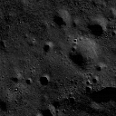

# Pipeline

- Download Dataset of TMC images
- Interpolate each pixel of TMC image to it's corresponding coordinates to get lunar coordinate of each pixel according to haversine formula.
- Download NAC images and it's corresponding corner coordinates.
- Get coordinates of all the pixels of NAC images according to the linear interpolation of corner coordinates due to the very small spatial size of NAC images.
- Cut TMC images corresponding to each NAC image.
- The TMC image hence obtained will act as the low resolution image and the NAC image will act as the corresponding high resolution images.
- For the model, we intend to use the Real-ESRGAN super resolution model and further finetune it to lunar images.
- For finetuning, we first finetuned using the `Generate degraded images on the fly` method described in the Real_ESR_GAN repository. In this method, we use just the NAC images to finetune our model.
- In the second step of finetuning, we use the paired dataset we made to finetune the model further.

## Note
1. The github repository for Real ESR GAN can be found at: `https://github.com/xinntao/Real-ESRGAN`
2. Further training descriptions can be found in the `training.md` file in the Real ESR GAN repository.

## Results on pretrained network
Original Image
 

Super Resoluted Image
 

## A Few More Instructions
- The fine tuning was perfomed on High Perfomance Cluster (HPC) but we were not able to submit the weights as the model is taking a long time to learn from the input data and is still running.
- We have changed the following in the above repository:
    - Created the directory 'datasets' for storing the input data and meta  data
    - Changes in 'options/finetune_realesrgan_x4plus.yml'
        - dataroot_gt: datasets
        - meta_info: datasets/meta/meta_data.txt
            - meta_data was generated for all the files present in the datasets which was used for fine tuning
        - batch_size_per_gpu: 2
        - total_iter: 15000
